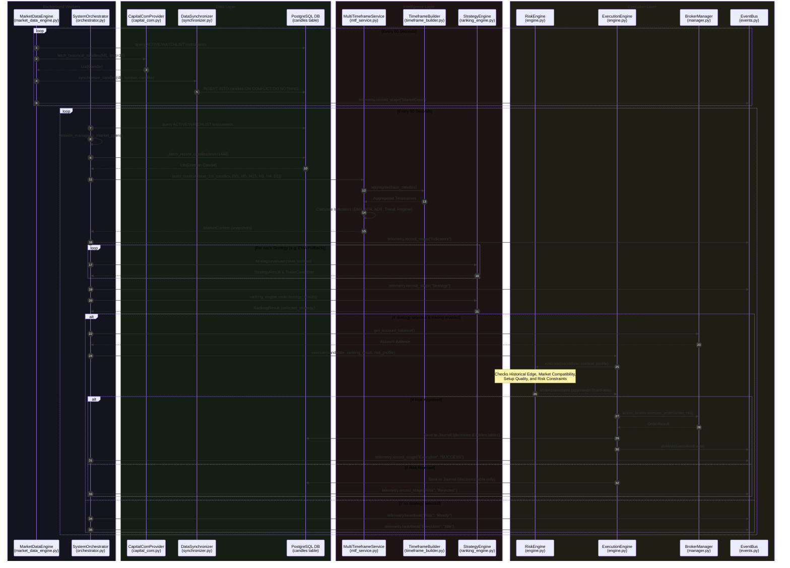

# Aegis Trading System (ATS) - Codebase Pipeline Diagram

This diagram represents the exact, actual execution flow of ATS based on the Python codebase, tracing what happens from the moment market data is fetched to the moment an order is executed.

## Codebase Pipeline Breakdown

### 1. Market Data Ingestion (`market_data_engine.py`)
This runs entirely decoupled from analysis in an `asyncio` task loop.
1. `_poll_all_instruments()` selects `ACTIVE` and `WATCHLIST` instruments from the database.
2. Calls `provider.fetch_historical_candles()` (using `CapitalComProvider`) to get the latest 10 1-minute candles.
3. Passes candles to `synchronizer.synchronize_candles()` which attempts to fill gaps and performs a bulk `INSERT INTO candles ... ON CONFLICT DO NOTHING`.
4. Emits a `MarketData` telemetry stage success event to the WebSocket.

### 2. The Orchestrator Loop (`orchestrator.py`)
This is the core trading loop (`_scan_all_instruments()`) that runs sequentially across all instruments.
1. **Fetch Data:** `_fetch_recent_candles()` pulls the last 1440 1-minute candles (24 hours) directly from the `candles` PostgreSQL table.
2. **Intelligence:** Passes the raw 1M candles to `MultiTimeframeService.build_context()`.
   * `TimeframeBuilder` loops over the target timeframes (M5, M15, H1, H4, D1) and aggregates the 1-minute data into higher timeframe candles.
   * Calculates technical indicators (EMA, ADX, ATR, MACD, etc) for *every* timeframe and bundles them into `MarketSnapshot` objects.
3. **Strategy:** Loops through all registered strategies in `StrategyRankingEngine.strategies` and calls `evaluate()`. Returns a `StrategyResult` which may contain a valid `TradeCandidate` (Signal).
4. **Ranking:** If multiple strategies trigger, `ranking_engine.rank()` applies a scoring matrix based on market regime and trends to pick a single winner.
5. **Risk Assessment:** The `winner_candidate` is passed to `ExecutionEngine.execute()`, which immediately calls `RiskEngine.evaluate()`. The Risk Engine performs hard math constraints (e.g. daily loss limits, setup quality score, position sizing).
6. **Execution:** If Risk passes, `ExecutionEngine` routes it to `BrokerManager`, triggering a live API call to Capital.com to open the position. Finally, the trade is saved to the `JournalService` (DB) and an event is broadcasted.
